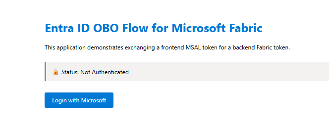
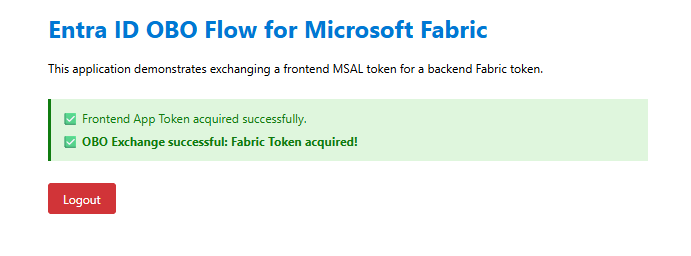

# Entra ID OBO (On-Behalf-Of) Flow for Microsoft Fabric with Plotly Dash

A minimal, production-ready reference implementation demonstrating how to securely exchange a frontend user token for a middle-tier Fabric access token using the Entra ID On-Behalf-Of (OBO) flow. 

This architecture pattern is critical for building custom GenAI agents or backend services that need to query Microsoft Fabric Data Warehouses/Lakehouses while strictly adhering to the user's native Row-Level Security (RLS) and workspace permissions.

Read the full architectural deep-dive on my blog: [The Disciplined Architect: Securing Agentic AI - Implementing Entra ID OBO Flow for Microsoft Fabric](https://disciplined-architect.hashnode.dev/securing-agentic-ai-implementing-entra-id-obo-flow-for-microsoft-fabric).

## Architecture & Server-Side Authentication

This demo strictly implements a **Server-Side Authentication Flow** to prevent exposing sensitive tokens to the client browser.

1. **Dash Presentation Layer:** Provides the UI and triggers the login route.
2. **Flask Backend (Middle-Tier):** Handles the MSAL authorization code flow (server-side authentication) and requests an `access_token` scoped to the application.
3. **App-Level Authorization:** The backend verifies if the user belongs to an approved Entra ID Security Group before proceeding.
4. **OBO Token Exchange:** The backend uses the app-scoped token as an assertion to request a new token specifically scoped to Microsoft Fabric (`https://analysis.windows.net/powerbi/api/.default`).
5. **Result:** The backend holds a token that can be securely packed into an ODBC connection string to query Fabric *as the user*.

## Defense in Depth: Security Groups & Workspace Roles

This demo implements a two-tier security model:
1. **Application-Level Gate:** Configured via the `ALLOWED_GROUPS` environment variable. If the user is not in the specified Entra ID Security Group, access to the app is blocked immediately (403 Forbidden).
2. **Database-Level Gate:** Passing the security group check does *not* grant automatic access to Fabric data. Because of the OBO flow, the user must still have the appropriate RBAC roles in the **Fabric Workspace** (e.g., Viewer, Member) and specific SQL endpoint permissions.

## Prerequisites

To run this demo, you need to configure an App Registration in Microsoft Entra ID.

### 1. Entra ID App Registration
Create a new App Registration and configure the following:
*   **Authentication:** Add a **Web** platform. Set the Redirect URI exactly to `http://localhost:8000/getAToken`. Enable **ID tokens**.
*   **Certificates & secrets:** Create a new Client Secret and save the value.
*   **Token Configuration (For Security Groups):** Go to Token Configuration -> Add groups claim -> Select **Security groups**. (Without this, the app cannot verify group membership).
*   **API Permissions (The OBO requirement):** 
    *   Add permission -> Power BI Service -> **Delegated permissions**
    *   Select scopes like `Workspace.Read.All` or `Lakehouse.Read.All`.
    *   *Note: These permissions typically require explicit IT Admin Consent in an enterprise tenant.*

*(Architect's Note: In a true N-tier architecture with a decoupled frontend like React, you would also need to configure "Expose an API" on your middle-tier app. For this monolithic Dash demo, we simplify the setup by requesting a token for the app's own Client ID before performing the OBO exchange.)*

### 2. Environment Variables
Copy the provided `.env.example` file to a new file named `.env`. Fill in your Entra ID details and (optionally) the Object ID of your Security Group.

```env
TENANT_ID="your-tenant-id"
CLIENT_ID="your-client-id"
CLIENT_SECRET="your-client-secret"
# Leave empty to allow all authenticated users, or add comma-separated Object IDs
ALLOWED_GROUPS="your-security-group-object-id"
```

## Running the Demo

1. Install dependencies:
   ```bash
   pip install -r requirements.txt
   ```

2. Run the Dash application:
   ```bash
   python app.py
   ```

3. Navigate to `http://localhost:8000` and click "Login with Microsoft".

4. After authenticating, the UI will display the successful acquisition of both the Frontend Token and the exchanged Fabric OBO Token.

### Screenshots

* **Before Authentication:**
  

* **After Successful OBO Flow:**
  

## Disclaimer
This is a minimal reproducible example (MRE) intended for architectural demonstration. In a production environment, ensure tokens are securely cached (e.g., using Redis) and secrets are managed via Azure Key Vault. Do not commit your `.env` file to version control.